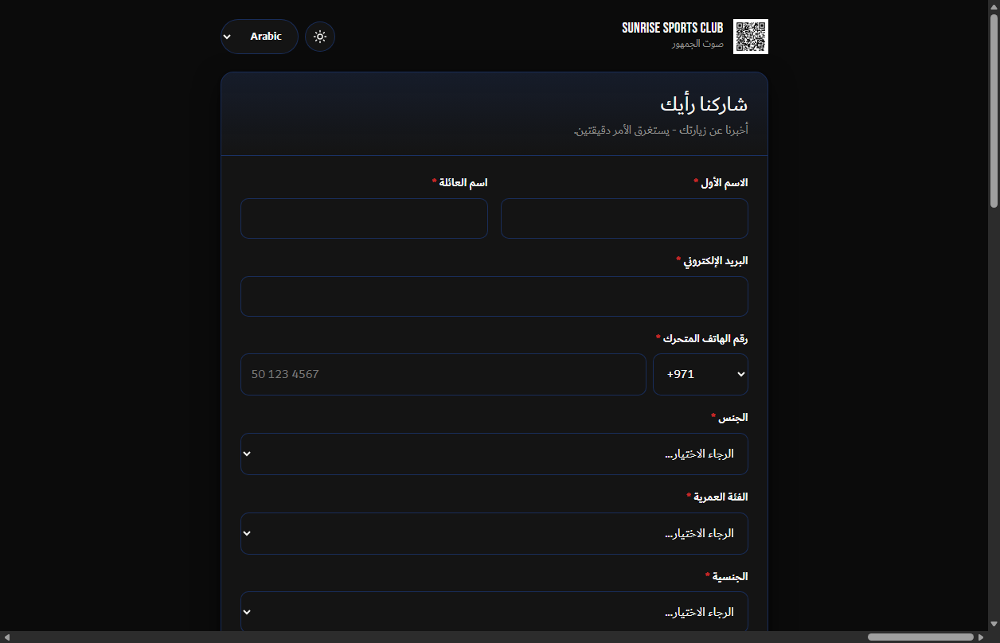
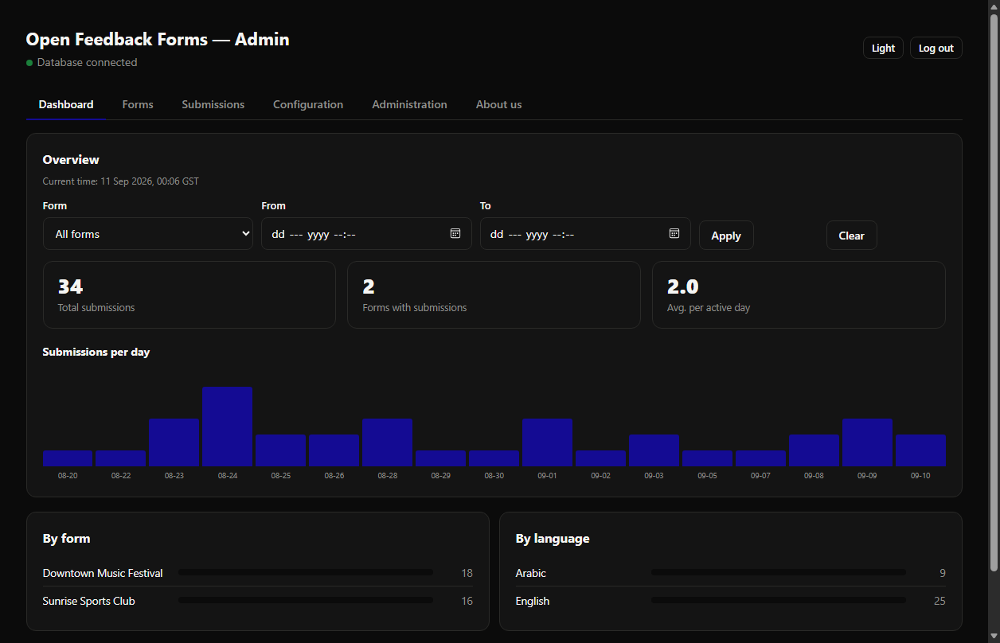
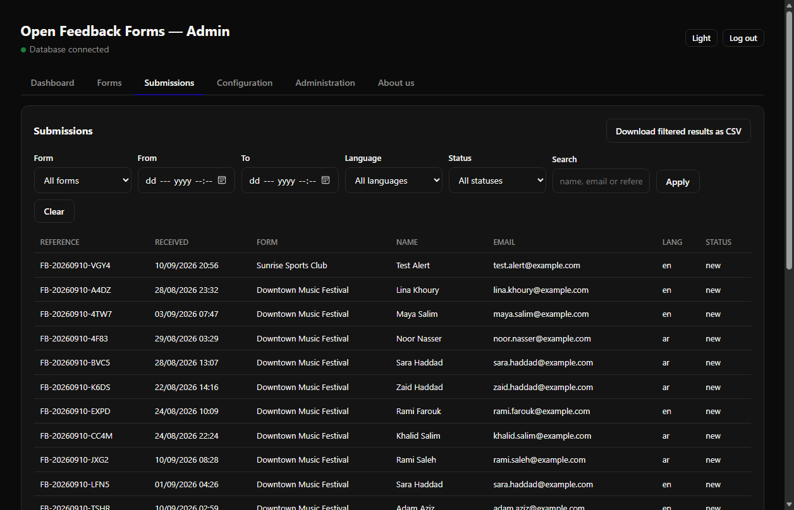
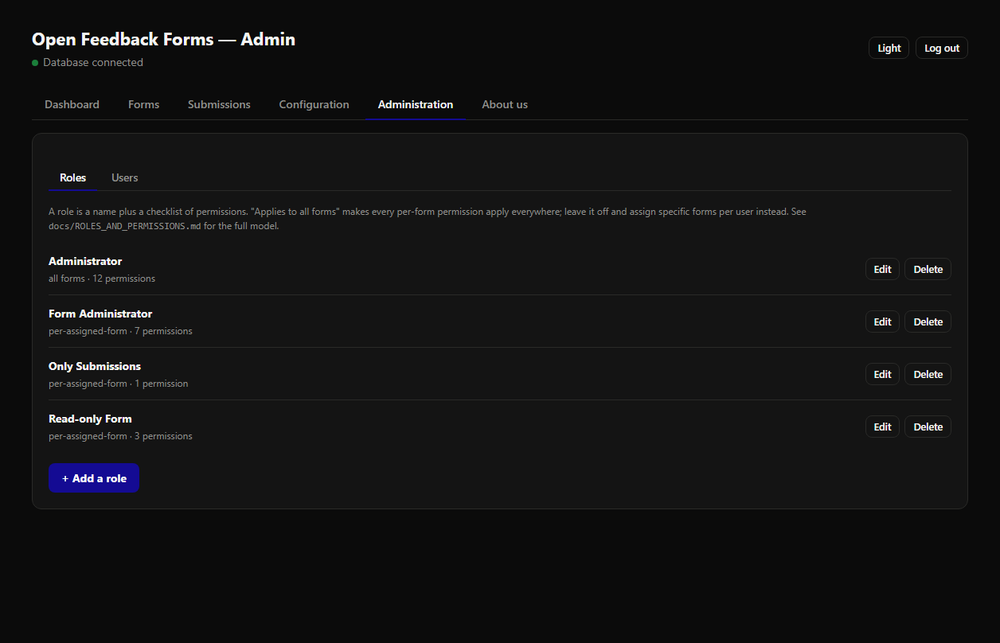
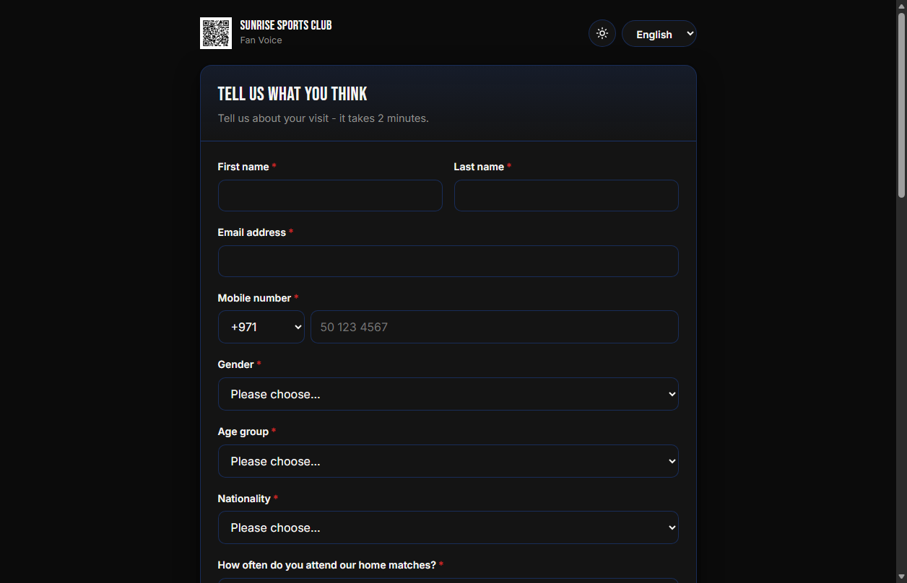
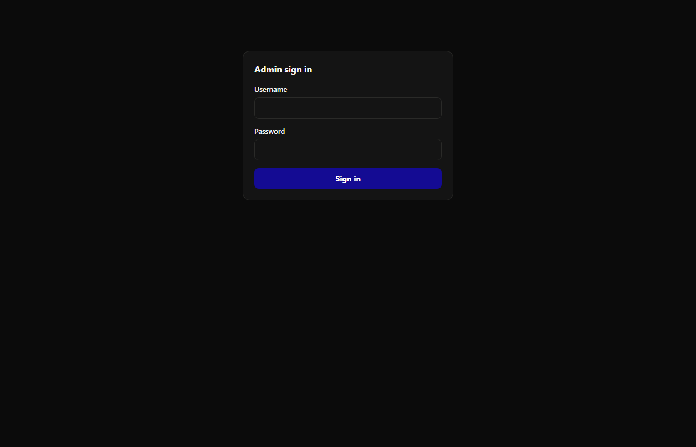
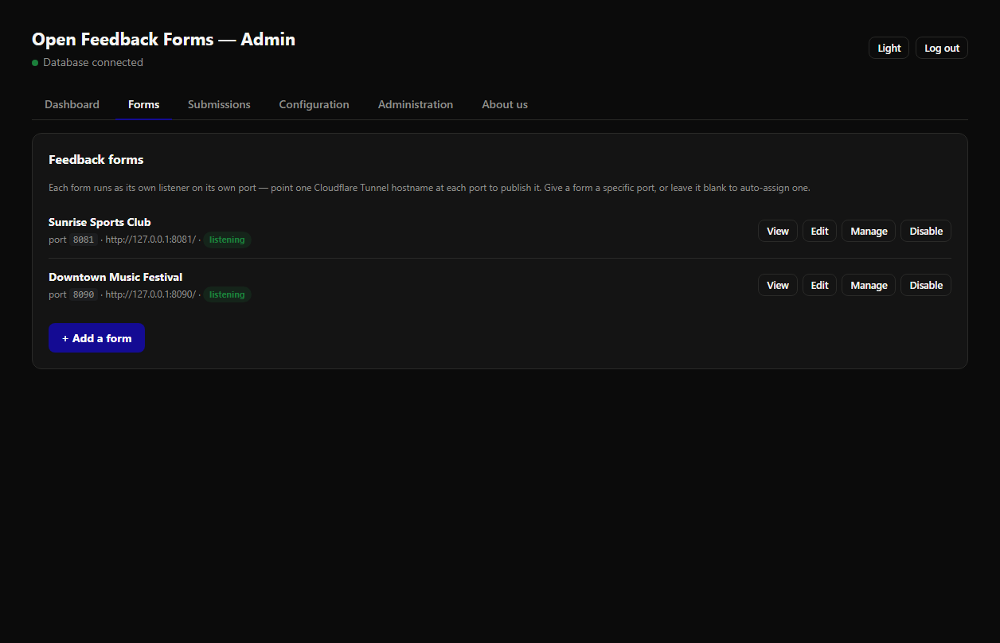
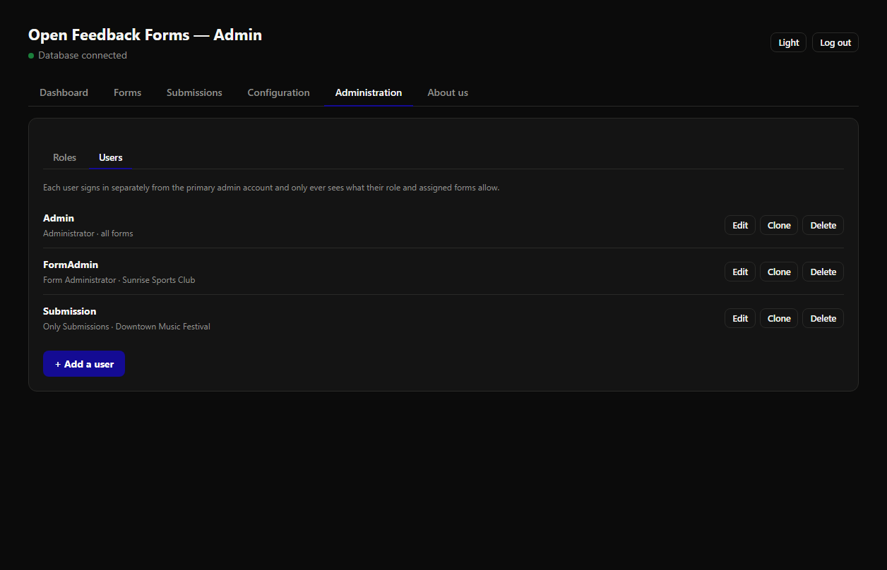

# Open Feedback Forms

A self-hosted, bilingual (English / Arabic) fan/customer feedback form —
built for sports clubs, but generic enough for any organization. Runs any
number of forms, each with its own port, its own logo/colors/name, and its
own question set, plus one admin panel to manage all of them.

No external services required. The app itself is pure Python (standard
library only, aside from the MariaDB driver); submissions and question
definitions are stored in a MariaDB/MySQL database you point it at.

## Screenshots

| | |
|---|---|
| **Public form — bilingual, RTL-aware**<br>Every form supports English and Arabic (plus any languages you add) out of the box — direction, fonts and layout all flip automatically. |  |
| **Dashboard**<br>Submissions over time, by form, by language — filterable by date range and form. |  |
| **Submissions**<br>Filter by form, date range, language, status and free text; download exactly what's filtered as CSV. |  |
| **Custom roles & users**<br>Build a role from a permission checklist — full access, one form only, read-only, whatever you need — and assign it to any number of users. |  |

<details>
<summary>More screenshots</summary>

| English public form | Admin sign-in |
|---|---|
|  |  |

| Forms list | Users |
|---|---|
|  |  |

</details>

```
public/index.html    the public form page — fetches its questions and
                      branding from the server, renders them dynamically
admin/index.html     the admin panel — forms, fields, branding, submissions
server.py            the app: one listener per form (each its own port),
                      plus one admin listener
db.py                schema, seed data, and all database access
config_store.py       local config.json — DB creds, admin account, session
                      secret (must exist before the app can reach a database)
translate_client.py   LibreTranslate API client, used only by "Add a
                      language" in Configuration → Language Labels
notifier.py            SMTP/Telegram alert delivery — new submissions, a
                      form's daily digest, database-disconnected, expiry
docs/ROLES_AND_PERMISSIONS.md
                      the custom-roles/permission-checklist pattern behind
                      Configuration → Administration, written to be
                      reusable outside this project too
packaging/            MSI installer build (PyInstaller + WiX), Windows only
Dockerfile, docker-compose.yml, install.sh, docker/
                      container image, compose services, and the one-line
                      setup wizard — see "Run it with Docker" below
VERSION                current release version, printed at startup
```

## Run it with Docker (recommended on Linux/macOS)

```bash
curl -fsSL https://raw.githubusercontent.com/cloudit24/open-feedback-forms/main/install.sh | sh
```

Clones the repo, walks you through the database step — a bundled MariaDB
container with a randomly generated password, your own existing database, or
skip it for now — then builds and starts everything. Open
http://localhost:8080/admin afterward to create your admin account (always
done through the web form itself, never over the script).

Already have the repo cloned? Run `./install.sh` from inside it instead of
piping the one-liner — it detects the existing checkout and reuses it. See
`.env.example` for every setting the wizard writes to `.env`, and
`docker-compose.yml` for the two services (`app`, and `db` — only started
when you choose the bundled-database option).

**To update an existing install**, re-run the same one-liner (or
`./install.sh` from inside the checkout) — it pulls the latest code and
rebuilds the containers. `.env` and your database are untouched. Or by hand:

```bash
cd open-feedback-forms
git pull
docker compose up -d --build
```

## Run it on Windows

```powershell
.\start.ps1
```

Then open http://127.0.0.1:8080/admin, create the admin account, and enter
your MariaDB connection details — the required tables are created and
seeded automatically on first successful connect, and the first form starts
listening right away (default port 8081).

Requires Python 3.9+ and `pip install -r requirements.txt` (just
`mysql-connector-python`) if running from source. The packaged `.msi`
bundles its own Python runtime — nothing to install on the target machine.

## Multiple forms, one process

Each form the admin panel creates gets its own `ThreadingHTTPServer`
listening on its own port — pick a specific port when creating a form, or
leave it blank to auto-assign one. Point one Cloudflare Tunnel hostname (or
any reverse proxy) at each form's port to publish it independently.

The admin panel itself always runs on one separate port (`ADMIN_PORT`,
default 8080) and is never meant to be exposed publicly — put it behind
Cloudflare Access, a VPN, or similar.

## Branding, per form

Each form has its own **Branding** settings in the admin panel: a logo
(PNG/JPG/WEBP/SVG, under 2 MB), an organization name, and two brand colors.
The public page fetches this alongside its questions and applies it at
runtime — no rebuild needed, and no single hardcoded identity baked into
the app.

## Questions, per form

Each form ships with a starter set of questions (name, mobile, gender, age
group, nationality, attendance frequency, a six-part matchday-experience
rating, overall satisfaction, NPS, an open feedback field, and a marketing
opt-in) that the admin can freely edit, reorder, add to, or retire — changes
apply to the public page immediately, no deploy required.

## Getting the data out

The **Submissions** tab in the admin panel lists every response, filterable
by form, date range, status and free-text search, with a **Download as CSV**
link that respects the current filters. CSV opens correctly in Excel with
Arabic text intact.

## What stops abuse

| Layer | What it does |
|---|---|
| Honeypot | A hidden field people never see. Bots fill it; those submissions are quietly discarded. |
| Rate limit | 5 saved submissions per visitor per hour, per form. Failed attempts don't count against it. A separate looser guard catches flooding. |
| Turnstile | Cloudflare's invisible bot check — set `TURNSTILE_SECRET` to turn it on. Off by default. |
| Server-side validation | Every field is re-checked on arrival against that form's current question definitions. The browser's checks are a convenience, not a defence. |
| Parameterised SQL | Field contents can never be executed as database commands. |
| Body size cap | Requests over 64 KB are refused outright (logo uploads get a larger, separate cap). |

Rate-limit counts and admin sessions live in memory, so restarting the app
clears them.

## The visitor's real IP address

Behind a tunnel every request appears to come from your own machine. The
real visitor's address arrives in Cloudflare's `CF-Connecting-IP` header (or
`X-Forwarded-For` behind another proxy), which is what the app reads and
stores — without it, rate limiting would treat every visitor as one person.

## Privacy

You're collecting names, emails, phone numbers and other personal fields —
check what data-protection law applies to you (e.g. UAE PDPL, GDPR). The
form already shows a plain-language notice and an unticked consent box, and
refuses any submission without consent. Still on you:

- Decide how long you keep records, and delete them after that.
- Name someone who handles deletion/access requests.
- Keep the database credentials and `config.json` out of any shared or
  public location — see `.gitignore`.

## Building the installer

```powershell
.\packaging\build-msi.ps1
```

Produces `packaging\out\OpenFeedbackForms.msi` — a per-user install (no
admin rights needed) that bundles its own Python runtime via PyInstaller,
compiled into a real MSI with WiX v5 (`dotnet tool install --global wix`,
version 5.x — avoid v6+, which requires accepting a paid EULA).

## About us

**Cloud IT 24** is an IT services company that designs, builds and supports
technology solutions across every kind of infrastructure — on-premises,
cloud and hybrid. From custom software development and systems integration
to networking, security and day-to-day operations, we help organizations
run reliably today and grow with confidence tomorrow.

We favour practical, well-engineered solutions over complexity: tools that
are simple to deploy, straightforward to maintain, and built to keep working
long after the project ends. Open Feedback Forms is one of them — developed,
maintained and released as open source by the Cloud IT 24 team.

- [github.com/cloudit24](https://github.com/cloudit24/)
- [github.com/shatheitguy](https://github.com/shatheitguy)
